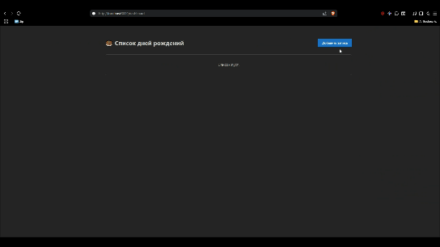
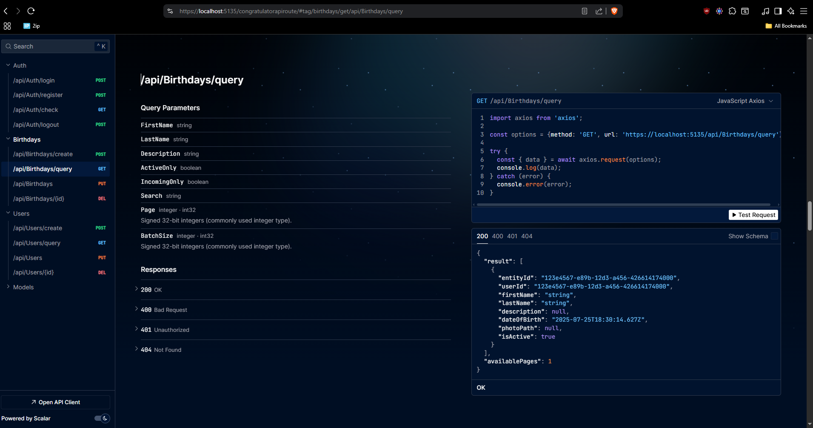
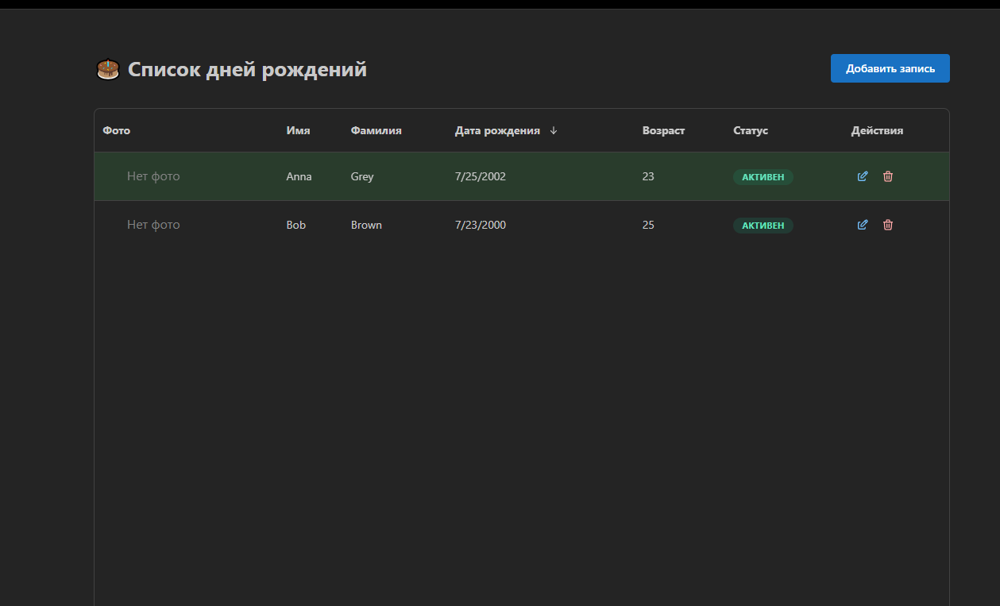
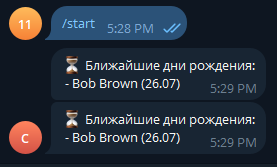

# Congratulator

migration commands:
- dotnet ef migrations add 0.0.1 --project src/backend/Infrastructure/Congratulator.Infrastructure/Congratulator.Infrastructure.csproj --startup-project src/backend/Host/Congratulator.API/Congratulator.API.csproj --output-dir Migrations
- dotnet ef database update --project src/backend/Infrastructure/Congratulator.Infrastructure/Congratulator.Infrastructure.csproj --startup-project src/backend/Host/Congratulator.API/Congratulator.API.csproj

